[](https://git.io/typing-svg)

# PharmaPOS — Pharmacy Point of Sale

A modern pharmacy POS built with Next.js, TypeScript, Tailwind CSS, and Supabase. Process sales at the cashier with member tier pricing (Silver / Gold / Platinum), earn and redeem loyalty points, apply voucher codes, manage products and prescriptions, and operate across multiple branches — all from one dashboard.

---

## Demo Login

| Field    | Value                   |
| -------- | ----------------------- |
| Email    | `admin@pharmapos.com`   |
| Password | `admin123`              |

---

## Screenshots

### Cashier checkout flow


### App pages

| Dashboard | Cashier | Members |
| --- | --- | --- |
| 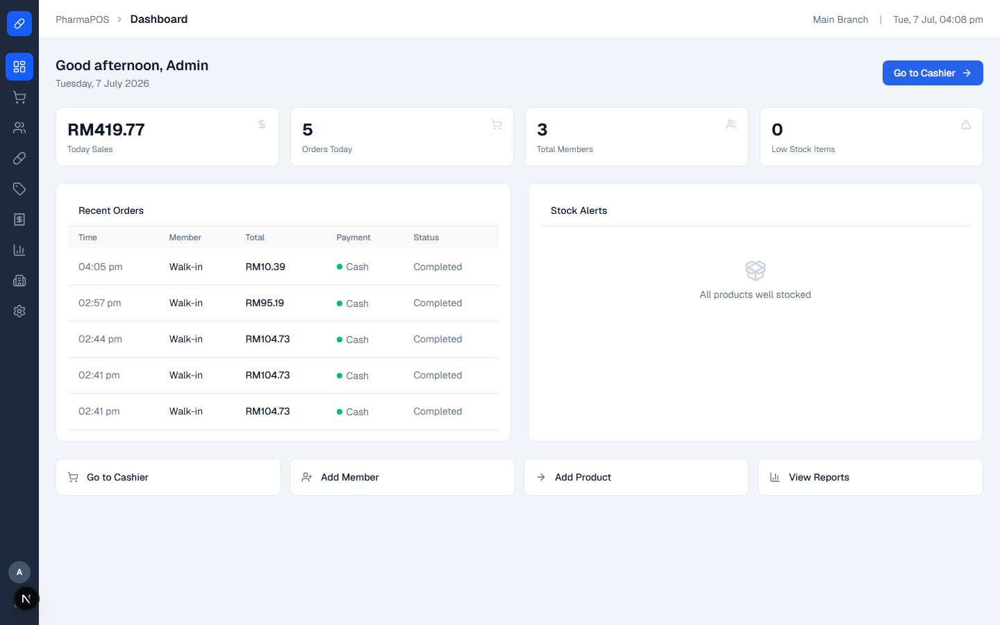 | 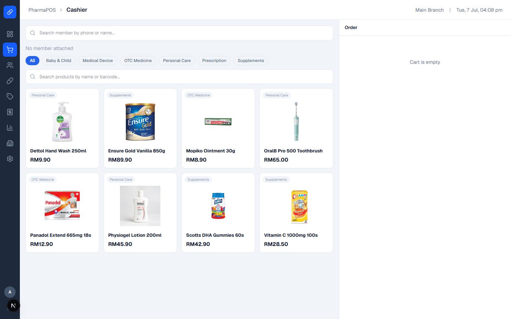 | 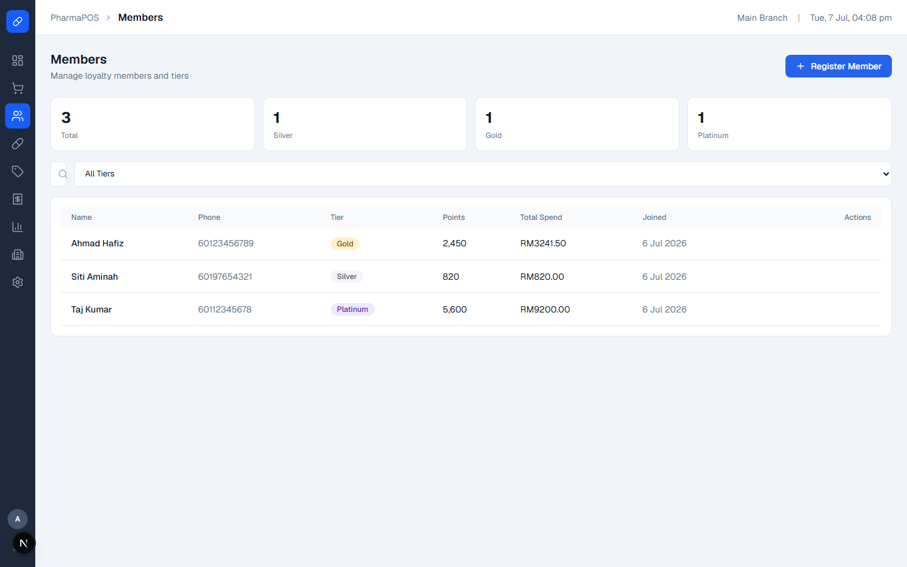 |

| Products | Promotions | Orders |
| --- | --- | --- |
| 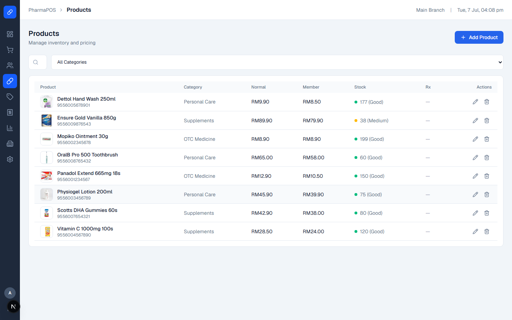 | 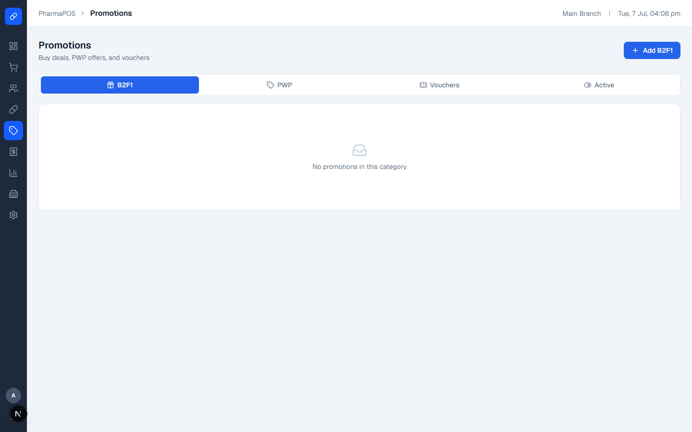 | 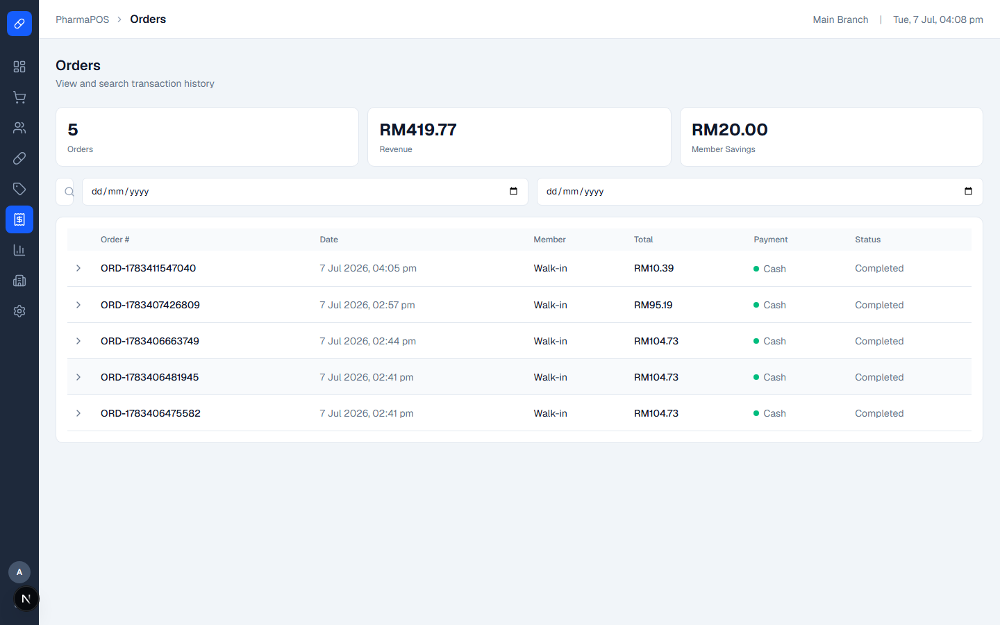 |

| Reports | Branches | Settings |
| --- | --- | --- |
| 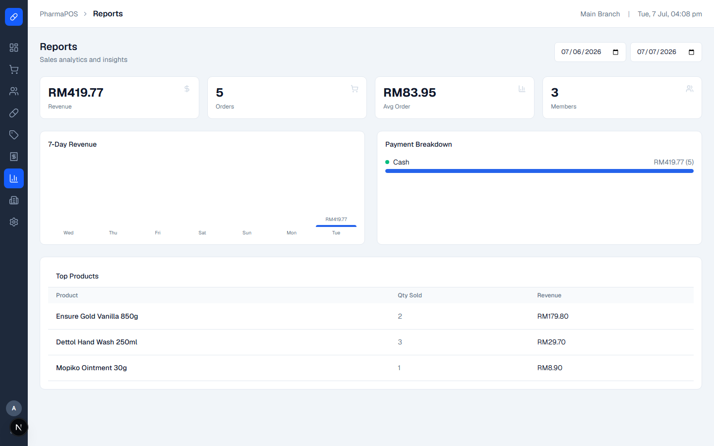 | 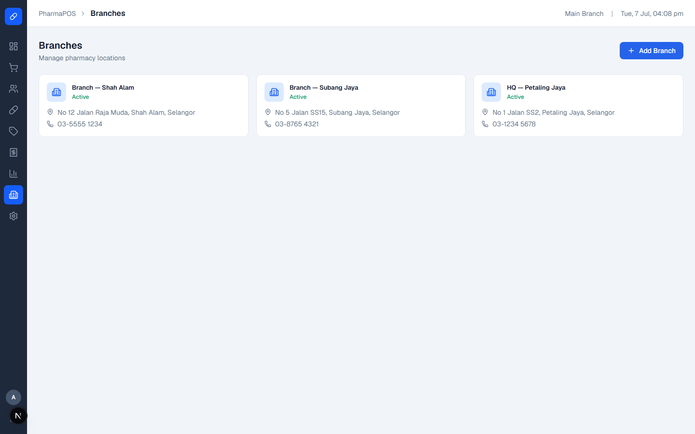 | 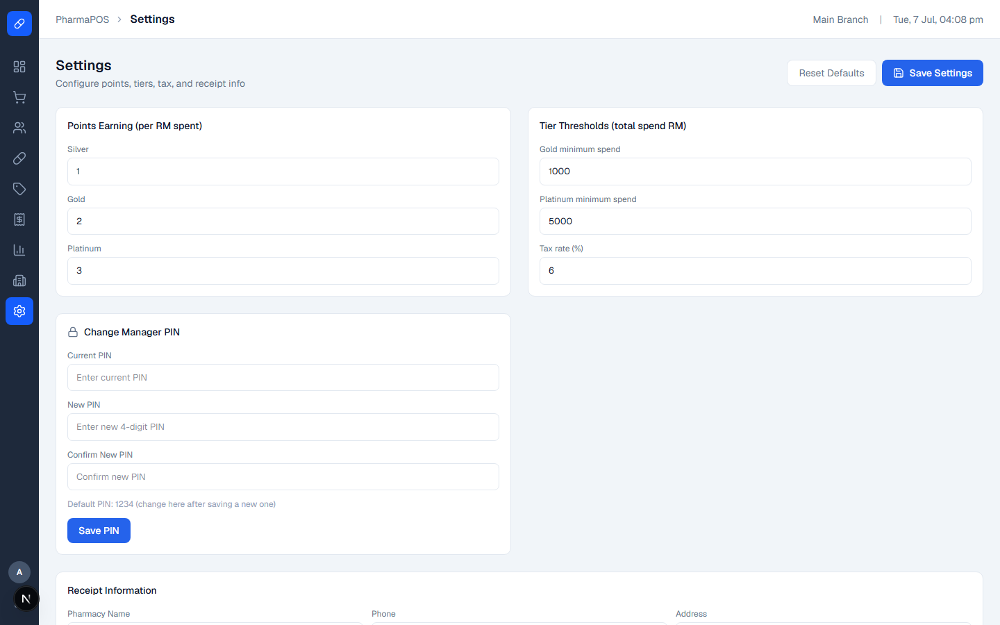 |

### Receipt

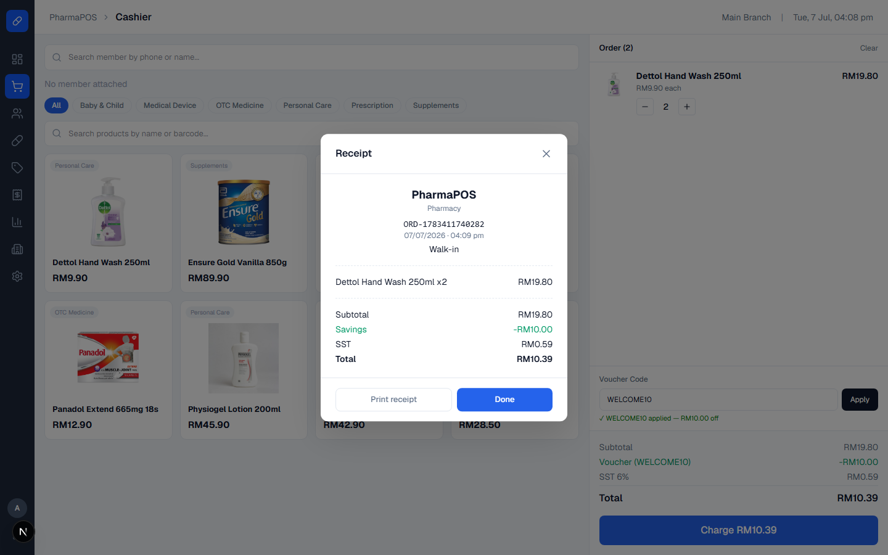

---

## Features

### Done & Working

- Secure login with demo credentials
- Dashboard with daily KPIs and quick actions
- Cashier — product search, member lookup, tier pricing, B2F1 promos, voucher codes, points redemption
- Members — profiles, Silver / Gold / Platinum tiers, points balance and history
- Products — catalog with image upload, stock levels, Rx flag, member pricing
- Orders — full order history with expandable line items
- Checkout — Cash, Card, TnG eWallet, DuitNow QR; printable receipt modal
- Multi-branch session support (branch + staff context)

### In Progress

- **Promotions** — voucher / B2F1 / PWP management UI polish
- **Reports** — sales analytics and chart refinements
- **Branches** — branch stats and management workflows
- **Settings** — store preferences and manager PIN configuration

---

## Tech Stack

[](https://skillicons.dev)

---

## Roadmap

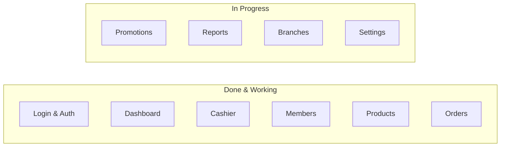

---

## Getting Started

### Prerequisites

- Node.js 18+
- A [Supabase](https://supabase.com) account

### Installation

```bash
git clone https://github.com/Thivya0050/pos-system.git
cd pos-system
npm install
cp .env.local.example .env.local
# Add your Supabase keys to .env.local
npm run dev
```

Open [http://localhost:3000](http://localhost:3000) in your browser.

---

## Database Setup

Run the following SQL in your **Supabase SQL Editor**. Column names match `src/types/database.ts`.

```sql
-- branches
CREATE TABLE branches (
  id UUID DEFAULT gen_random_uuid() PRIMARY KEY,
  name TEXT NOT NULL,
  address TEXT,
  phone TEXT,
  is_active BOOLEAN NOT NULL DEFAULT true,
  created_at TIMESTAMPTZ DEFAULT NOW()
);

-- staff
CREATE TABLE staff (
  id UUID DEFAULT gen_random_uuid() PRIMARY KEY,
  branch_id UUID REFERENCES branches(id),
  name TEXT NOT NULL,
  email TEXT NOT NULL,
  password TEXT,
  role TEXT NOT NULL,
  is_active BOOLEAN NOT NULL DEFAULT true,
  created_at TIMESTAMPTZ DEFAULT NOW()
);

-- members
CREATE TABLE members (
  id UUID DEFAULT gen_random_uuid() PRIMARY KEY,
  branch_id UUID REFERENCES branches(id),
  name TEXT NOT NULL,
  phone TEXT NOT NULL,
  ic_number TEXT,
  email TEXT,
  date_of_birth DATE,
  tier TEXT NOT NULL DEFAULT 'silver',
  points INTEGER NOT NULL DEFAULT 0,
  total_spend DECIMAL(10,2) NOT NULL DEFAULT 0,
  created_at TIMESTAMPTZ DEFAULT NOW()
);

-- categories
CREATE TABLE categories (
  id UUID DEFAULT gen_random_uuid() PRIMARY KEY,
  name TEXT NOT NULL,
  created_at TIMESTAMPTZ DEFAULT NOW()
);

-- products
CREATE TABLE products (
  id UUID DEFAULT gen_random_uuid() PRIMARY KEY,
  category_id UUID REFERENCES categories(id),
  name TEXT NOT NULL,
  barcode TEXT,
  normal_price DECIMAL(10,2) NOT NULL,
  member_price DECIMAL(10,2) NOT NULL,
  gold_price DECIMAL(10,2),
  platinum_price DECIMAL(10,2),
  stock INTEGER NOT NULL DEFAULT 0,
  low_stock_threshold INTEGER DEFAULT 10,
  is_active BOOLEAN NOT NULL DEFAULT true,
  image_url TEXT,
  requires_prescription BOOLEAN NOT NULL DEFAULT false,
  created_at TIMESTAMPTZ DEFAULT NOW()
);

-- promotions
CREATE TABLE promotions (
  id UUID DEFAULT gen_random_uuid() PRIMARY KEY,
  type TEXT NOT NULL,
  name TEXT NOT NULL,
  product_id UUID REFERENCES products(id),
  reward_product_id UUID REFERENCES products(id),
  min_qty INTEGER,
  free_qty INTEGER,
  reward_price DECIMAL(10,2),
  applies_to TEXT DEFAULT 'all',
  voucher_code TEXT,
  discount_type TEXT,
  discount_value DECIMAL(10,2),
  max_uses INTEGER,
  uses_count INTEGER DEFAULT 0,
  start_date DATE,
  end_date DATE,
  is_active BOOLEAN NOT NULL DEFAULT true,
  created_at TIMESTAMPTZ DEFAULT NOW()
);

-- orders
CREATE TABLE orders (
  id UUID DEFAULT gen_random_uuid() PRIMARY KEY,
  order_number TEXT NOT NULL,
  branch_id UUID REFERENCES branches(id),
  staff_id UUID REFERENCES staff(id),
  member_id UUID REFERENCES members(id),
  subtotal DECIMAL(10,2) NOT NULL,
  discount_amount DECIMAL(10,2) NOT NULL DEFAULT 0,
  voucher_discount DECIMAL(10,2) NOT NULL DEFAULT 0,
  points_discount DECIMAL(10,2) NOT NULL DEFAULT 0,
  tax DECIMAL(10,2) NOT NULL,
  total DECIMAL(10,2) NOT NULL,
  payment_method TEXT NOT NULL DEFAULT 'cash',
  status TEXT NOT NULL DEFAULT 'completed',
  points_earned INTEGER NOT NULL DEFAULT 0,
  points_redeemed INTEGER NOT NULL DEFAULT 0,
  created_at TIMESTAMPTZ DEFAULT NOW()
);

-- order_items
CREATE TABLE order_items (
  id UUID DEFAULT gen_random_uuid() PRIMARY KEY,
  order_id UUID REFERENCES orders(id) ON DELETE CASCADE,
  product_id UUID REFERENCES products(id),
  product_name TEXT NOT NULL,
  normal_price DECIMAL(10,2) NOT NULL,
  sold_price DECIMAL(10,2) NOT NULL,
  quantity INTEGER NOT NULL,
  free_quantity INTEGER NOT NULL DEFAULT 0,
  promo_applied TEXT,
  created_at TIMESTAMPTZ DEFAULT NOW()
);

-- points_history
CREATE TABLE points_history (
  id UUID DEFAULT gen_random_uuid() PRIMARY KEY,
  member_id UUID REFERENCES members(id),
  order_id UUID REFERENCES orders(id),
  points INTEGER NOT NULL,
  description TEXT NOT NULL,
  created_at TIMESTAMPTZ DEFAULT NOW()
);

-- member_vouchers
CREATE TABLE member_vouchers (
  id UUID DEFAULT gen_random_uuid() PRIMARY KEY,
  member_id UUID REFERENCES members(id),
  promotion_id UUID REFERENCES promotions(id),
  code TEXT NOT NULL,
  is_used BOOLEAN NOT NULL DEFAULT false,
  used_at TIMESTAMPTZ,
  created_at TIMESTAMPTZ DEFAULT NOW()
);

-- Row Level Security (allow public access for demo)
ALTER TABLE branches ENABLE ROW LEVEL SECURITY;
ALTER TABLE staff ENABLE ROW LEVEL SECURITY;
ALTER TABLE members ENABLE ROW LEVEL SECURITY;
ALTER TABLE categories ENABLE ROW LEVEL SECURITY;
ALTER TABLE products ENABLE ROW LEVEL SECURITY;
ALTER TABLE promotions ENABLE ROW LEVEL SECURITY;
ALTER TABLE orders ENABLE ROW LEVEL SECURITY;
ALTER TABLE order_items ENABLE ROW LEVEL SECURITY;
ALTER TABLE points_history ENABLE ROW LEVEL SECURITY;
ALTER TABLE member_vouchers ENABLE ROW LEVEL SECURITY;

CREATE POLICY "Allow all on branches" ON branches FOR ALL USING (true);
CREATE POLICY "Allow all on staff" ON staff FOR ALL USING (true);
CREATE POLICY "Allow all on members" ON members FOR ALL USING (true);
CREATE POLICY "Allow all on categories" ON categories FOR ALL USING (true);
CREATE POLICY "Allow all on products" ON products FOR ALL USING (true);
CREATE POLICY "Allow all on promotions" ON promotions FOR ALL USING (true);
CREATE POLICY "Allow all on orders" ON orders FOR ALL USING (true);
CREATE POLICY "Allow all on order_items" ON order_items FOR ALL USING (true);
CREATE POLICY "Allow all on points_history" ON points_history FOR ALL USING (true);
CREATE POLICY "Allow all on member_vouchers" ON member_vouchers FOR ALL USING (true);
```

---

## Environment Variables

Create a `.env.local` file in the project root:

```env
NEXT_PUBLIC_SUPABASE_URL=your_supabase_url
NEXT_PUBLIC_SUPABASE_ANON_KEY=your_supabase_anon_key
```

| Variable                         | Description                    |
| -------------------------------- | ------------------------------ |
| `NEXT_PUBLIC_SUPABASE_URL`       | Your Supabase project URL      |
| `NEXT_PUBLIC_SUPABASE_ANON_KEY`  | Your Supabase anon/public key  |

---

Built with care by Thivya
